# IQM V3.5 APP
## Intelligent Question Maker

This repository, developed by Stefan Pietrusky, describes the prototype IQM. IQM is a Flask-based quiz application that allows learners to automatically generate and edit practice questions from their own or uploaded materials. First, users can upload a PDF file, which is converted to text in the background using PyPDF2 and stored in the file system. Alternatively, existing text sources can be selected. A difficulty level is then set before the questions are generated via a button.

There are two ways to generate responses: If an OpenAI API key is specified, the request is forwarded to the OpenAI API; otherwise, processing is performed locally via Ollama. The selected context from the uploaded file is integrated into the prompt, allowing for different types of questions (multiple choice, true/false, open-ended questions, sequencing, fill-in-the-blank, and matching tasks).

The generated tasks appear in the quiz interface, where learners enter their answers. Each answer is sent to the Flask app via a button, which controls the LLM with an evaluation prompt. For open-ended questions, the model provides a structured evaluation (four evaluation categories and an overall assessment), which is validated, processed, and output as feedback.

At the same time, progress is tracked. Correct and incorrect answers are counted, and the current learning status is saved. Based on this data, the app ultimately makes a recommendation for the next learning level, for example, whether a higher or lower level of difficulty is appropriate. The app thus combines automated content preparation, interactive processing, and adaptive feedback into a closed learning workflow.

> **⚠️ Work in Progress:** This prototyp is currently under active development. While I make it available for research purposes, please be aware that there will be some changes to the functional structure. I recognize that some current technical design decisions may not be optimal and are subject to revision. Researchers using this prototyp should expect potential updates and changes. I recommend checking back regularly for updates and versioning information.

## IQM V3.5 Structure
The structure of the current [V3.5] IQM app is shown below.


## Interface of the IQM V3.5 app


## Installing and running the application 
1. Clone this repository on your local computer: 
```bash 
git clone https://github.com/stefanpietrusky/iqm.git
```
2. Install the required dependencies:
```bash 
pip install -r requirements.txt
```
3. Install [Ollama](https://ollama.com/) and load a model for example [gemma3](https://ollama.com/library/gemma3) (4B) or another.
4. Start the app with:
```bash 
python app.py
```
[](https://iqm-lite.up.railway.app/)
